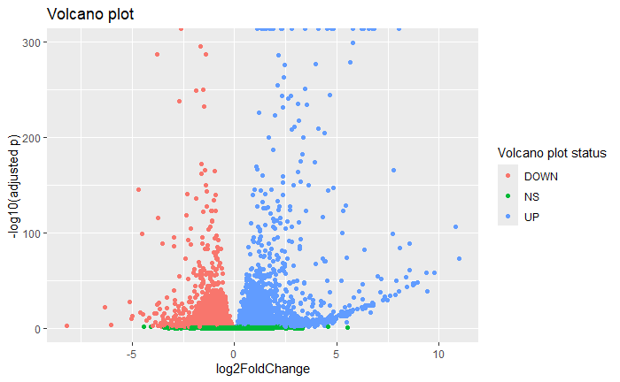

Bulk RNAseq Analysis
====================
Derek Breton

-  [Purpose](#purpose)
-  [Introduction](#introduction)
-  [Methods](#methods)
-  [Results](#results)
    -  [PCA](#pca)
    -  [Differential expression analysis](#differential-expression-analysis)
    -  [Gene set enrichment analysis](#gene-set-enrichment-analysis)
-  [Citations](#citations)

Purpose
-------
The objective of this project is to develop a general-purpose, end-to-end pipeline for analyzing bulk RNA sequencing data. The pipeline, built using Snakemake, allows the user to conveniently download FASTQ files from the NCBI sequence read archive (SRA), streamlining results replication. Quality control statistics are gathered from the reads using FastQC and MultiQC before performing pseudo-alignment using Kallisto. Downstream analysis includes principal component analysis (PCA), differential expression analysis using Deseq2, and gene set enrichment analysis using FGSEA.  

The following is an example use of the pipeline, replicating the results from [Koch et al. 2024](https://doi.org/10.1016/j.virusres.2024.199337)

Introduction
------------
Marburg virus (MARV), a highly pathogenic filovirus, causes server hemorrhagic fever with high fatality rates, posing a significant public health threat. Furthermore, the virus causes significant damage to the kidneys, which results in an increased mortailty rate. Proximal tubular cells (PTC) are key targets during MARV infection that play critical roles in energy metabolism, but the virus's effects on host cellular processes of these cells remain incompletely understood. The study "Transcriptomics of Marburg virus-infected primary proximal tubular cells reveals negative correlation of immune response and energy metabolism" [1] provides novel insights into these interactions, revealing pro-inflammatory pathways that may downregulate metabolic processes within the PTC. To test the reproducibility of the original conclusions and provide further insight, I aim to replicate the bioinformatics analyses, leveraging transcriptomic data and computational approaches to confirm the interplay between immune responses and energy metabolism during MARV infection.

Methods
-------
Raw RNA sequencing data (FASTQ files) were obtained via the SRA Toolkit, and consisted of 12 untreated PTC samples, 12 infected PTC samples after 20 hours of infection, and 12 infected PTC samples after 40 hours of infection. Quality control was ititially performed on the samples using FastQC v0.12.1-0 [2]. Transcript abundance was quantified using Kallisto v0.50.0 [3]. First, a Kallisto index was constructed from a combined FASTA file of cDNA and ncRNA sequences downloaded from Ensembl GRCh38 (release 113). The FASTA files were merged and indexed with Kallisto using default k-mer length. Raw RNA-Seq paired end reads were pseudo-aligned to the reference index using Kallisto’s quant function with 50 bootstrap samples and and estimated fragment length of 200 basepairs with a standard deviation of 20 basepairs. Transcript abundance estimates were output as transcript per million (TPM) and estimated counts. These estimated counts were then used for downstream analysis. Principal component analysis (PCA) was performed using the prcomp function in R v4.3.1. Differential expression analysis was performed using DESeq2 v1.42.0 [4] using default parameters. Gene set enrichment analysis (GSEA) was performed using FGSEA v1.28.0 [5] using log2foldchange as a ranking metric and MSigDB hallmark gene sets [6].

Results
-------

### PCA

These results show that there are genes in the data that distingush between the conditions. Clear clusters are shown based on condition, suggesting condition is a major source of variance in the data. 

### Differential expression analysis

### Gene set enrichment analysis

Downregulated gene sets include targets of E2F and MYC, the G2M checkpoint, and oxidative phosphorylation. Inflammatory and cholesterol homeostasis gene sets are strongly upregulated.

Conclusion
----------
Results suggest that MARV infection of PTC induces inflammatory pathways within the cells, inhibiting key metabolic regulatory factors. These results show strong agreement with the author's findings, suggesting a potential factor in MARV-induced kidney damage. 

Citations
---------
1. https://doi.org/10.1016/j.virusres.2024.199337
2. https://www.bioinformatics.babraham.ac.uk/projects/fastqc/
3. https://www.nature.com/articles/nbt.3519
4. https://genomebiology.biomedcentral.com/articles/10.1186/s13059-014-0550-8
5. http://biorxiv.org/content/early/2016/06/20/060012
6. https://www.gsea-msigdb.org/gsea/msigdb/download_file.jsp?filePath=/msigdb/release/2024.1.Hs/h.all.v2024.1.Hs.symbols.gmt
